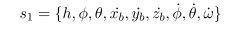
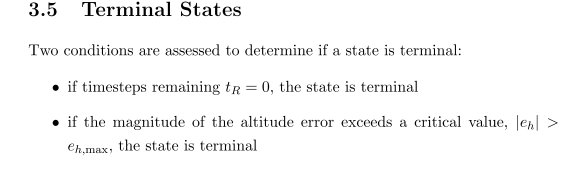

# 1. Introduction

aircraft upset incidents have remained the “highest risk to civil aviation” in the past several decades [Loss of Control In-Flight Accident Analysis Report]. Therefore, it is particularly important to rescue the aircraft from an out-of-control state. As a result, upset recovery have been approached with various approaches including adaptive control , machine learning , and model-predictive control. 

Paper[Switching control architecture with parametric optimization for aircraft upset recovery]describes a novel finite-state conditional switching structure that enables autonomous recovery for a large envelope of loss-of-control conditions.

## Reinforcement Learning

The RL agent aims to maximise its cumulative reward over each episode.
However, in the general case the agent has no knowledge a priori of the en- vironment transition dynamics, P, or the reward function, R. Therefore the agent learns through interactions with the environment, and applies an appro- priate algorithm to improve its policy in response to experience.

《Autonomous Control of Simulated Fixed Wing Aircraft using Deep Reinforcement Learning 》

Reinforcement learning (RL) methods enable a vehicle to autonomously discover an optimal behavior through trial-and-error interactions with the environment. This is based on the common sense idea that if an action results in a satisfactory or better situation, then the tendency to produce that action in the starting situation is reinforced. Instead of explicitly hard-code the behavior for the task, the designer of the control task solely provides the feedback regarding a scalar objective function that measures the one-step performance of the UAV

《Deep reinforcement learning as control method for autonomous UAVs》

# 2.

## aircraft

.

## 自旋

《A review and historical development of analytical techniques to predict aircraft spin and recovery characteristics》

Spin is one of the most complex aircraft maneuver and has
been a subject of numerous research projects, tests and investigations since the early years of aviation. A spin is defined as an aggravated stall, which results in autorotation of an aircraft while descending in a helical pattern about the vertical spin axis. In an aggravated stall, one wing is stalled more than the other as shown in Figure 1(a). The more stalled wing experiences less lift and more drag as compared to other and this imbalance of forces initiates autorotation and subsequent rapid decent of the aircraft (Bennett and Lawson, 2018)

A complete spin maneuver can be divided into three distinct
phases, as shown in Figure 1(b). Incipient spin is a non-steady phase during which aircraft flight path changes from horizontal to vertical and the rotation rate increases to that of fully developed spin. Fully developed spin is an equilibrium state in which aerodynamic and inertia forces and moments are balanced. An aircraft follows a helical trajectory about a vertical axis with constant angular velocity and descent rate.

An aircraft spin can be classified as a steep or flat spin.
Steep spins are characterized by lower angles of attack (20oto 45o), low rotation rates, large spin radius and high descent rate. Flat spins are characterized by high angles of attack (50oto 90o), small spin radii and high rotation rates. Owing to fast rotation rates at extremely high angles of attack, flat spins are considered very dangerous and accounts for significant proportion of aircraft accidents.

## 尾旋/失速

《Optimization of aircraft spin recovery maneuvers》

Aircraft spin is a nonlinear post-stall phenomena in which an
aircraft develops a high rotational-rate and descends almost vertically in a helical trajectory

## Aircraft Control as a Markov Decision Process

The agent is given control over the (normalised) position of its ailerons, rudder and elevator (see Figure 2-4) by allowing it to input commanded positions, c:

where c denotes a commanded normalised position, subscript a denotes aileron, subscript e denotes elevator, and subscript r denotes rudder.

Engine controls such as throttle and fuel mixture settings are fixed at
constant values with no control provided to the agent.

The aircraft’s state representation is constructed by considering what infor- mation is essential to an agent to achieve the desired behaviour and preserve the Markov property. Firstly, the agent is provided knowledge of the aircraft’s position, orientation and velocities using the body-framed system described in Section 2.2.1:

The agent must also be provided information on the position of the aircraft’s control surfaces. When an agent commands a movement of a control surface to a given position (c) the effect on the actual position (δ) is not in- stantaneous. Therefore it is necessary to provide the agent information on the current control surface positions at each timestep to preserve the Markov property:

The target altitude and target heading are not directly provided to the
agent, but are implicitly observed through the altitude and heading error variables with the motivation that the policies learned should be more general.

.

# 3. control design

# 4. Experiments

### 4.1 non-wind effects

### 4.2 wind effects

To study the effects of wind on  recovery, simulations are
carried out with different uniform horizontal velocities. 

In this paper, we consider recovery from steep spiral
and period-one oscillatory spin upset conditions. Spiral and spin both are three-dimensional rotary motions, that is, they involve revolutions around more than one of the aircraft body axes. Hence,